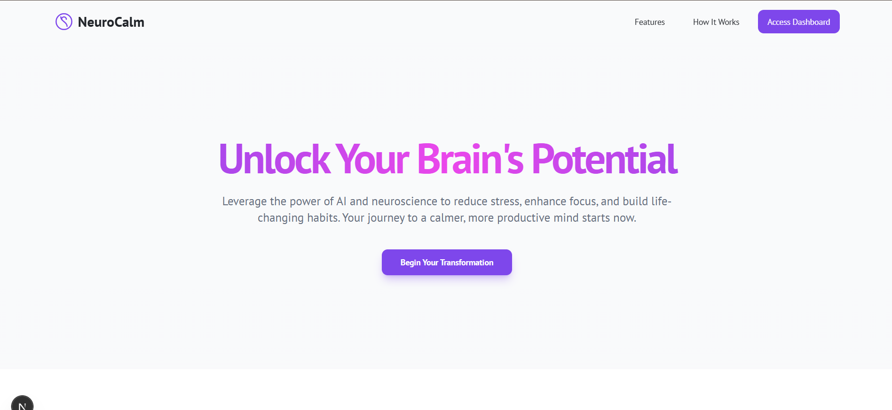

# **App Name**: NeuroCalm - AI Brain Coach v2.0

## Core Features:

- Daily Check-in: Users log daily mood, sleep, diet, exercise, and stressors through a simple interface of sliders and questions.
- Mental State Estimation: AI model analyzes daily self-reported data to estimate 'Calm Index' and 'Productivity Index'.
- Personalized Recommendations: The application uses the 'Calm Index' and 'Productivity index' scores to suggest personalized recommendations to help users rewire habits, reduce stress, and improve focus.
- AI Brain Coach Chatbot: A conversational AI assistant to answer questions and provide guidance.
- Progress Visualization: Display trends in 'Calm Score' and 'Productivity Score' through interactive charts and graphs.
- Profile and Settings: Allow users to adjust goals, manage personal data, and review their progress log.
- Habit Tool Recommendations: The application will make reasoned recommendations on ways that the user can re-align and detoxify their thinking by building better mental habits to improve focus and performance